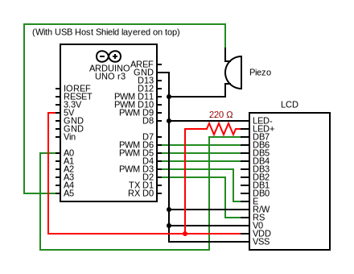
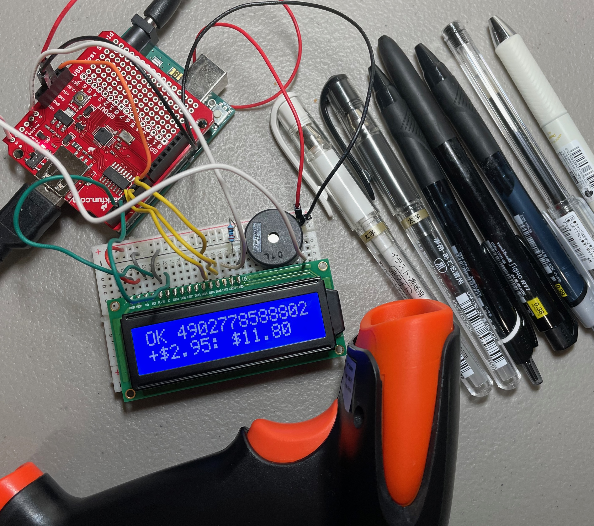

# Kino NBC Scanner

This project is a simple prototype of a product scanner for "Kino" (substitute name). The point is to show a potential alternative to manually pricing items that are not yet able to be entered into the official database. Additional constraints are not being connected to the register, and being cheap and duplicatable.

## Pictures

## Some Notes

* It has a hardcoded database of UPC and prices, and keeps a running sum of the total price of scanned products. If a scanned item is not in the database, it makes an error-beep using the wired piezo.
* Future work would be having a button to print a list of (product, quantity, price) to a wired receipt printer, so the customer can see how the subtotal was derived.

## Components Used

* Arduino Uno (Rev 3)
* Barcode Scanner (with USB cable)
* LCD Screen (16x2 characters)
* Piezo
* Sparkfun USB Host Shield (+ header pins to solder on)
* Wires
